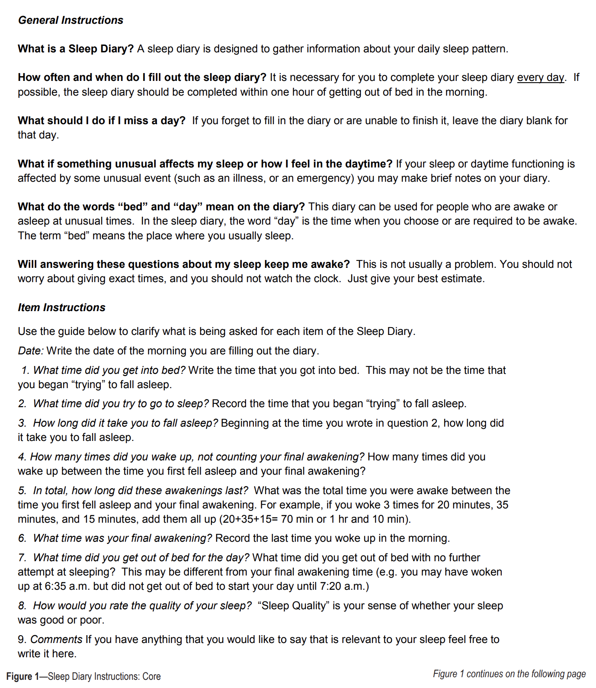

# **The Importance of Sleep**
## Mental Wellness Month Special
_A Journey Through Personal Stories, Insightful Videos, and Sleep Diaries_

---

# Agenda
1. **Introduction**
2. **Research**
3. **Personal Story Sharing**
4. **Video**
5. **Sleep Diary Exercise**

---

# Introduction
- **Why Sleep Matters**: Exploring the connection between sleep and mental wellness.

---

# Research
- **Getting More Sleep**
  - Studies have shown that sleep is inherently connected to improved studies and mental health for students.
    - [School Start Times](https://publications.aap.org/pediatrics/article/134/3/642/74175/School-Start-Times-for-Adolescents?autologincheck=redirected)
  - Insomnia in cognitively unimpaired adults at increased risk for AD is associated to poorer performance in some executive functions ...
    - [Insomnia <-> Cognitively Imparied Adults](https://alzres.biomedcentral.com/articles/10.1186/s13195-019-0547-3#:~:text=Insomnia%20in%20cognitively%20unimpaired%20adults,as%20decreased%20white%20matter%20diffusivity.)
  - "Among those with comorbid disorders, anxiety disorders preceded insomnia 73% of the time, while insomnia occurred first in 69% of comorbid insomnia and depression cases."
    - [Association of Insomnia with Anxiety/Depression](https://pubmed.ncbi.nlm.nih.gov/16978649/)

---

# Research (Blue lights are bad for you!!!!)

## **Circadian Ryhthyms**
One of the most notable studies was conducted by Charles A. Czeisler, a professor at Harvard Medical School, which explored how exposure to artificial light alters the human circadian rhythm.

---
## [Effect of Light on Human Circadian Physiology](https://pubmed.ncbi.nlm.nih.gov/20161220/)

- Participants were exposed to artificially controlled lighting environments for an extended period.
- Researchers manipulated the light exposure to study how it affected the participants' internal body clocks, or circadian rhythms.
- Demonstrated that artificial light, **especially blue light commonly emitted by screens and modern lighting**, could significantly shift or disrupt the body's internal clock.

---
# Videos
- Smarter Every Day (an Amazing science/learning channel on Youtube)
  - [Why do we have to sleep?](https://www.youtube.com/watch?v=3mufsteNrTI)
- Restoring sleep as a critical element of health (Oregon State University, College of Health)
  - "[Why Sleep Matters](https://www.youtube.com/watch?v=1ESr9eLtPl0)"
- A much longer (1.5+ hours) talk about Sleep from Harvard Medical School, ironically also titled:
    - [Why Sleep Matters](https://www.youtube.com/watch?v=LmwgGkJ64CM)
- Charles A. Czeisler - Sleep, circadian rhythms, health and performance
  - [Lecture/Video](https://www.csail.mit.edu/node/6085)
- What would happen if we didn't Sleep?
  - [TED-Ed](https://www.youtube.com/watch?v=dqONk48l5vY)

---

# Sleep Diary Exercise
- **Track Your Sleep**: For the next week, keep a daily log of your sleep patterns.
- **Parameters to Note**:
  - Total sleep hours.
  - Sleep quality (1-10 scale).
  - Wake-up mood.
  - Daytime alertness.

---

# Personal Story Sharing
- **Sharing Experiences**: Sharing personal stories about how sleep affects your mental health.
  - Sharing with others can reduce the stigma around sleep issues
  - Everyone always jokes about getting 'bad sleep', how many of us share how we have overcome it?
- **Learning from Each Other**: There are common themes and differences in our experiences with sleep.
  - Keep a sleep diary and share with each other how we have used it to adjust our behaviors and improve our sleep over time.

---

## [The Consensus Sleep Diary](https://www.ncbi.nlm.nih.gov/pmc/articles/PMC3250369/pdf/aasm.35.2.287.pdf)

---

# Discussion and Closing
- ****Let's try one change for better sleep.****
